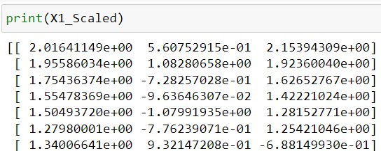
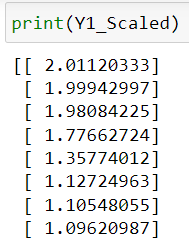

# Implementation-of-Linear-Regression-Using-Gradient-Descent

## AIM:
To write a program to predict the profit of a city using the linear regression model with gradient descent.

## Equipments Required:
1. Hardware – PCs
2. Anaconda – Python 3.7 Installation / Jupyter notebook

## Algorithm
1. Load and preprocess data:

    Load data using pandas.read_csv. Separate features (X) and target variable (y). Scale features and target variable using StandardScaler. Define the linear_regression function:

    Add a column of ones to X for the intercept term. Initialize theta (model parameters) with zeros. Perform gradient descent loop:

2. Inside the loop:

   Calculate predictions using the dot product of X and theta.
   Calculate errors as the difference between predictions and actual y values.
   Update theta using the gradient descent formula with learning rate.
3. Learn model parameters:

   Call the linear_regression function with scaled features and target variable.
   This function returns the learned theta (model parameters).
4. Predict for new data point:

5. Create a new data point.

   Scale the new data point using the fitted scaler.
6. Make prediction:

   Calculate the prediction using the scaled new data point, appended with a 1 for the intercept, and the learned theta.
   
   Inverse scale the prediction to get the original scale value.
7. Print the predicted value.

## Program:
```py
Program to implement the linear regression using gradient descent.
Developed by: Anish Raj P
RegisterNumber:  212222230010

import numpy as np
import pandas as pd
from sklearn.preprocessing import StandardScaler

def linear_regression(X1,y,learning_rate=0.01,num_iters=1000):
    X=np.c_[np.ones(len(X1)),X1]
    theta = np.zeros(X.shape[1]).reshape(-1,1)
    for _ in range(num_iters):
        predictions = (X).dot(theta).reshape(-1,1)
        errors = (predictions-y).reshape(-1,1)
        theta-=learning_rate*(1/len(X1))*X.T.dot(errors)
    return theta
    
data=pd.read_csv('50_Startups.csv',header=None)
data.head()
X = (data.iloc[1:,:-2].values)
print(X)

X1=X.astype(float)
scaler = StandardScaler()
y=(data.iloc[1:,-1].values).reshape(-1,1)
print(y)

X1_Scaled=scaler.fit_transform(X1)
Y1_Scaled=scaler.fit_transform(y)
print(X1_Scaled)
print(Y1_Scaled)

theta = linear_regression(X1_Scaled,Y1_Scaled)

new_data=np.array([165349.2,136897.8,471784.1]).reshape(-1,1)
new_Scaled = scaler.fit_transform(new_data)
prediction = np.dot(np.append(1,new_Scaled),theta)
prediction = prediction.reshape(-1,1)
pre=scaler.inverse_transform(prediction)
print(f"Predicted Value:{pre}")
```

## Output:

### X values

### y values

### X Scaled values

### y Scaled values

### Predicted value
 


## Result:
Thus the program to implement the linear regression using gradient descent is written and verified using python programming.
